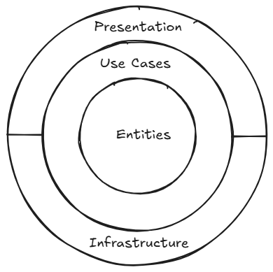
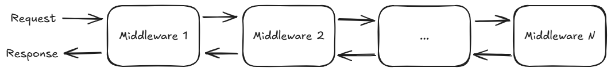

# Занятие 9. Построение web-приложений на базе чистой архитектуры

## Теоретическая часть

### Чистая архитектура

Чистая архитектура - это подход к проектированию программного обеспечения, который позволяет создавать модульные, легко тестируемые и поддерживаемые системы.

Чистая архитектура часто применяется при построении web-приложений.

Приложения, построенные на базе чистой архитектуры, обычно разделены на четыре слоя:

- Entities - слой, который отвечает за основные сущности и правила их взаимодействия.
- Use Cases - слой, который отвечает за координацию взаимодействия между сущностями и другими компонентами приложения.
- Infrastructure - слой, который отвечает за реализацию взаимодействия с внешним миром (базы данных, логирование, другие сервисы и т.д.).
- Presentation - слой, который отвечает за отображение данных для пользователя.

Визуально слои можно изобразить следующим образом:



Как можно видеть из схемы, слой Entities обернут в слой Use Cases, а тот в свою очередь обернут в комбинированный слой Infrastructure and Presentation.

Слово "оборачивает" здесь означает, что внешний слой может взаимодействовать с внутренним слоем, но не наоборот.

В C# обычно каждый слой представлен в виде одного или нескольких проектов. Если какому-то слою нужно взаимодействовать с другим слоем, то это оформляется в виде ссылок между проектами. При этом само взаимодействие осуществляется через интерфейсы и их реализации.

### ASP.NET Core

ASP.NET Core - это фреймворк для построения web-приложений на базе .NET.

Существует два основных способа построения web-приложений на базе ASP.NET Core:

- MVC (Model-View-Controller) - этот способ построения web-приложений основан на принципах MVC, где каждый тип компонента (Model, View или Controller) явно представлен во фреймворке.
- Minimal API - это относительно новый способ построения web-приложений, введенный в .NET 6 и постепенно набирающий популярность.

Независимо от того, какой способ выбран, принципы, которые лежат в основе фреймворка, не меняются. Рассмотрим их подробнее.

#### Конвейер обработки запроса

ASP.NET Core использует конвейер обработки запроса для обработки входящих запросов. Конвейер обработки запроса состоит из различных этапов, называемых middleware.

Визуально конвейер обработки запроса можно изобразить следующим образом:



Как можно увидеть из схемы, результат обработки запросы от одного из middleware передается на обработку следующему middleware. Аналогичная ситуация происходит и с ответами - результат обработки ответа от одного из middleware передается на обработку middleware, стоящему перед ним. По сути, здесь используется паттерн Decorator. Middleware могут реализовывать абсолютно любые функции - от проверки авторизации до вызова прикладных сервисов для обработки запроса. Собственно, это и происходит в реальных приложениях.

#### Dependency Injection

Приложения, построенные на базе ASP.NET Core всегда так или иначе используют Dependency Injection, так как сам фреймворк построен на этом принципе. Для удобства во фреймворк встроен собственный DI-контейнер от Microsoft - разработчику лишь необходимо зарегистрировать в нем сервисы, которые будут использоваться в приложении.

#### HTTP-сервер

Чтобы приложение могло принимать HTTP-запросы, оно должно использовать HTTP-сервер. ASP.NET Core поддерживает несколько HTTP-серверов:

- Kestrel - это HTTP-сервер, который используется по умолчанию в ASP.NET Core.
- IIS - это HTTP-сервер, который используется в Windows.

В современных production-приложениях обычно используется Kestrel.

## Практическая часть

В рамках практической части мы рассмотрим решение задачи из [занятия по DDD](../08-ddd), но в виде web-приложения и чистой архитектуры.

### Создание проекта

Начнем с создания проекта. Мы будем использовать подход с использованием Minimal API. Как выше описывалось, приложения, основанные на чистой архитектуре, обычно состоят из нескольких проектов. Поэтому создадим все необходимые проекты и настроим ссылки между ними:

```bash
# Создание решения
dotnet new solution -n 09-clean-architecture
dotnet sln migrate
rm 09-clean-architecture.sln

# Создание проектов
dotnet new classlib -n AutoMarketApp.Entities
dotnet new classlib -n AutoMarketApp.UseCases
dotnet new classlib -n AutoMarketApp.Infrastructure
dotnet new classlib -n AutoMarketApp.Presentation
dotnet new webapi -n AutoMarketApp.Host

# Добавление проектов в решение
dotnet sln add ./AutoMarketApp.Entities/AutoMarketApp.Entities.csproj
dotnet sln add ./AutoMarketApp.UseCases/AutoMarketApp.UseCases.csproj
dotnet sln add ./AutoMarketApp.Infrastructure/AutoMarketApp.Infrastructure.csproj
dotnet sln add ./AutoMarketApp.Presentation/AutoMarketApp.Presentation.csproj
dotnet sln add ./AutoMarketApp.Host/AutoMarketApp.Host.csproj

# Добавление ссылок между проектами
dotnet add ./AutoMarketApp.UseCases/AutoMarketApp.UseCases.csproj reference ./AutoMarketApp.Entities/AutoMarketApp.Entities.csproj
dotnet add ./AutoMarketApp.Infrastructure/AutoMarketApp.Infrastructure.csproj reference ./AutoMarketApp.UseCases/AutoMarketApp.UseCases.csproj
dotnet add ./AutoMarketApp.Presentation/AutoMarketApp.Presentation.csproj reference ./AutoMarketApp.UseCases/AutoMarketApp.UseCases.csproj
dotnet add ./AutoMarketApp.Host/AutoMarketApp.Host.csproj reference ./AutoMarketApp.Presentation/AutoMarketApp.Presentation.csproj
dotnet add ./AutoMarketApp.Host/AutoMarketApp.Host.csproj reference ./AutoMarketApp.Infrastructure/AutoMarketApp.Infrastructure.csproj
dotnet add ./AutoMarketApp.Host/AutoMarketApp.Host.csproj reference ./AutoMarketApp.UseCases/AutoMarketApp.UseCases.csproj

# Добавление пакетов
dotnet add ./AutoMarketApp.UseCases/AutoMarketApp.UseCases.csproj package Microsoft.Extensions.DependencyInjection.Abstractions
dotnet add ./AutoMarketApp.UseCases/AutoMarketApp.UseCases.csproj package Riok.Mapperly
dotnet add ./AutoMarketApp.Infrastructure/AutoMarketApp.Infrastructure.csproj package Microsoft.Extensions.DependencyInjection.Abstractions
dotnet add ./AutoMarketApp.Infrastructure/AutoMarketApp.Infrastructure.csproj package Riok.Mapperly
dotnet add ./AutoMarketApp.Presentation/AutoMarketApp.Presentation.csproj package Microsoft.AspNetCore.OpenApi
dotnet add ./AutoMarketApp.Host/AutoMarketApp.Host.csproj package Microsoft.AspNetCore.OpenApi
dotnet add ./AutoMarketApp.Host/AutoMarketApp.Host.csproj package Swashbuckle.AspNetCore.SwaggerUI
```

На данном этапе настройка проектов почти будет завершена. Останется лишь добавить в файл `AutoMarketApp.Presentation/AutoMarketApp.Presentation.csproj` следующую секцию:

```xml
  <ItemGroup>
    <FrameworkReference Include="Microsoft.AspNetCore.App" />
  </ItemGroup>
```

Данная секция добавляет возможность использовать API ASP.NET Core в проекте - нам понадобится данная возможность, чтобы вынести в отдельный проект (Presentation) объявление API-эндпоинтов.

### Сущности

По аналогии с [занятием по DDD](../08-ddd) мы будем оперировать следующими сущностями:

- Car;
- Customer.

Также при их описании мы воспользуемся нашими Value Objects:

- Email;
- MobilePhone;
- Sale;
- Reservation.

Основное отличие будет в том, что мы будем использовать анемичные сущности, а не богатые доменные модели. Вся сложная логика будет реализована в Use Cases.

Так как богатой моделью являлась только модель Car, то просто копируем из [занятия по DDD](../08-ddd) в каталог `Models` проекта `Entities` следующие классы:

- `Customer`;
- `Email`;
- `MobilePhone`;
- `Sale`;
- `Reservation`.

При этом меняем пространство имен на `AutoMarketApp.Entities.Models`.

Далее создадим класс `Car` в каталоге `Models` проекта `Entities`:

```csharp
namespace AutoMarketApp.Entities.Models;

/// <summary>
/// Entity representing a car in the AutoMarket
/// </summary>
public sealed class Car
{
    public Car(string vin, Reservation? reservation, Sale? sale)
    {
        if (string.IsNullOrWhiteSpace(vin))
            throw new ArgumentException("VIN cannot be empty", nameof(vin));

        Vin = vin;
        Reservation = reservation;
        Sale = sale;

        ValidateSaleAndReservation();
    }

    public string Vin { get; }
    public Reservation? Reservation { get; }
    public Sale? Sale { get; }

    private void ValidateSaleAndReservation()
    {
        if (Sale is not null && Reservation is not null)
            throw new InvalidOperationException("Car cannot be sold and reserved at the same time");
    }
}
```

Как можно увидеть из кода, мы убрали методы, описывающие бизнес-операции над автомобилем, и оставили только конструктор и свойства.

### Use Cases

В [занятии по DDD](../08-ddd) мы реализовали следующие сценарии:

- Вывод покупателей;
- Добавление покупателей;
- Вывод автомобилей;
- Добавление автомобилей;
- Бронирование автомобиля;
- Продажа автомобиля.

В данном занятии мы повторим эти же сценарии, но в виде Web API. Начнем с Use Cases.

#### Вывод покупателей

В отличие от предыдущей реализации, в текущей мы не будем использовать наши доменные сущности в слое презентации. Вместо этого мы будем использовать специально созданные DTO.

Начнем с ответа на запрос на вывод покупателей. Создадим в проекте `UseCases` каталог `Customers/ListCustomers` и в нем создадим класс `ListCustomersResponseItem` для представления одного покупателя:

```csharp
namespace AutoMarketApp.UseCases.Customers.ListCustomers;

public sealed record ListCustomersResponseItem(
    Guid Id,
    string Name,
    string Email,
    string Phone
);
```

Теперь создадим класс `ListCustomersResponse` для представления всего ответа на запрос:

```csharp
namespace AutoMarketApp.UseCases.Customers.ListCustomers;

public sealed record ListCustomersResponse(
    IReadOnlyList<ListCustomersResponseItem> Customers
);
```

Далее создадим интерфейс `IListCustomersRequestHandler` в каталоге `Customers/ListCustomers`:

```csharp
namespace AutoMarketApp.UseCases.Customers.ListCustomers;

public interface IListCustomersRequestHandler
{
    ListCustomersResponse Handle();
}
```

Этот интерфейс будет использован позже в слое представления для вызова данного сценария.

Для получения покупателей нам понадобится репозиторий. Объявим его интерфейс в каталоге `Customers/ListCustomers`:

```csharp
namespace AutoMarketApp.UseCases.Customers.ListCustomers;

public interface IListCustomersRepository
{
    IReadOnlyList<Customer> GetAll();
}
```

Также нам понадобится сервис-Mapper для преобразования наших сущностей в DTO и обратно. Объявим класс `CustomerMapper` в каталоге `Customers/ListCustomers` с использованием библиотеки `Riok.Mapperly`:

```csharp
namespace AutoMarketApp.UseCases.Customers.ListCustomers;

using AutoMarketApp.Entities.Models;
using Riok.Mapperly.Abstractions;

[Mapper]
internal static partial class CustomerMapper
{   
    internal static partial ListCustomersResponseItem ToDto(this Customer customer);
}
```

Теперь реализуем сам сценарий:

```csharp
namespace AutoMarketApp.UseCases.Customers.ListCustomers;

internal sealed class ListCustomersRequestHandler : IListCustomersRequestHandler
{
    private readonly IListCustomersRepository _repository;

    public ListCustomersRequestHandler(IListCustomersRepository repository)
    {
        _repository = repository;
    }

    public ListCustomersResponse HandleAsync(CancellationToken cancellationToken)
    {
        var customers = _repository.GetAll();

        return new ListCustomersResponse(customers.Select(CustomerMapper.ToDto).ToList());
    }
}
```

#### Добавление покупателя

По аналогии с предыдущим сценарием, реализуем сценарий добавления покупателя.

Начнем с отправки запроса на добавление покупателя. Создадим в каталоге `Customers/AddCustomer` класс `AddCustomerRequest` для представления запроса:

```csharp
namespace AutoMarketApp.UseCases.Customers.AddCustomer;

public sealed record AddCustomerRequest(
    string Name,
    string Email,
    string Phone
);
```

Далее создадим класс `AddCustomerResponse` для представления ответа на запрос:

```csharp
namespace AutoMarketApp.UseCases.Customers.AddCustomer;

public sealed record AddCustomerResponse(
    Guid Id
);
```

Далее создадим интерфейс `IAddCustomersRequestHandler` в каталоге `Customers/AddCustomer`:

```csharp
namespace AutoMarketApp.UseCases.Customers.AddCustomer;

public interface IAddCustomersRequestHandler
{
    AddCustomerResponse Handle(AddCustomerRequest request);
}
```

Объявим репозиторий для добавления покупателя в каталоге `Customers/AddCustomer`:

```csharp
namespace AutoMarketApp.UseCases.Customers.AddCustomer;

public interface IAddCustomersRepository
{
    void Add(Customer customer);
}
```

Также нам понадобится сервис-Mapper для преобразования наших сущностей в DTO и обратно. Объявим класс `CustomerMapper` в каталоге `Customers/AddCustomer`:

```csharp
namespace AutoMarketApp.UseCases.Customers.AddCustomer;

using AutoMarketApp.Entities.Models;

internal static class CustomerMapper
{
    public static Customer ToEntity(this AddCustomerRequest request) =>
        new Customer(
            Guid.NewGuid(),
            request.Name,
            new Email(request.Email),
            new MobilePhone(request.Phone));

    public static AddCustomerResponse ToDto(this Customer customer) =>
        new AddCustomerResponse(customer.Id);
}
```

Теперь реализуем сам сценарий:

```csharp
namespace AutoMarketApp.UseCases.Customers.AddCustomer;

internal sealed class AddCustomersRequestHandler : IAddCustomersRequestHandler
{
    private readonly IAddCustomersRepository _repository;

    public AddCustomersRequestHandler(IAddCustomersRepository repository)
    {
        _repository = repository;
    }

    public AddCustomerResponse Handle(AddCustomerRequest request)
    {
        var customer = request.ToEntity();

        _repository.Add(customer);

        return customer.ToDto();
    }
}
```

#### Вывод автомобилей

Реализуем сценарий вывода автомобилей.

DTO для представления автомобиля в каталоге `Cars/ListCars`:

```csharp
namespace AutoMarketApp.UseCases.Cars.ListCars;

public sealed record ListCarsResponseItem(
    string Vin,
    ReservationDto? Reservation,
    SaleDto? Sale
);
```

DTO для представления бронирования в каталоге `Cars/ListCars`:

```csharp
namespace AutoMarketApp.UseCases.Cars.ListCars;

public sealed record ReservationDto(
    DateTimeOffset ReservationDate,
    Guid CustomerId,
    DateTimeOffset ExpirationDate
);
```

DTO для представления продажи в каталоге `Cars/ListCars`:

```csharp
namespace AutoMarketApp.UseCases.Cars.ListCars;

public sealed record SaleDto(
    DateTimeOffset SaleDate,
    Guid CustomerId
);
```

DTO для представления всего ответа на запрос в каталоге `Cars/ListCars`:

```csharp
namespace AutoMarketApp.UseCases.Cars.ListCars;

public sealed record ListCarsResponse(
    IReadOnlyList<ListCarsResponseItem> Cars
);
```

Интерфейс репозитория для получения автомобилей в каталоге `Cars/ListCars`:

```csharp
namespace AutoMarketApp.UseCases.Cars.ListCars;

public interface IListCarsRepository
{
    IReadOnlyList<Car> GetAll();
}
```

Класс-mapper:

```csharp
namespace AutoMarketApp.UseCases.Cars.ListCars;

using AutoMarketApp.Entities.Models;
using Riok.Mapperly.Abstractions;

[Mapper]
internal static partial class CarMapper
{
    internal static partial ListCarsResponseItem ToDto(this Car car);
    [MapperIgnoreSource(nameof(Reservation.IsActive))]
    private static partial ReservationDto? ToDto(this Reservation? reservation);
    private static partial SaleDto ToDto(this Sale sale);
}
```

Интерфейс сценария:

```csharp
namespace AutoMarketApp.UseCases.Cars.ListCars;

public interface IListCarsRequestHandler
{
    ListCarsResponse Handle();
}
```

Реализация сценария:

```csharp
namespace AutoMarketApp.UseCases.Cars.ListCars;

internal sealed class ListCarsRequestHandler : IListCarsRequestHandler
{
    private readonly IListCarsRepository _repository;

    public ListCarsRequestHandler(IListCarsRepository repository)
    {
        _repository = repository;
    }

    public ListCarsResponse Handle()
    {
        var cars = _repository.GetAll();

        return new ListCarsResponse(cars.Select(CarMapper.ToDto).ToList());
    }
}
```

#### Добавление автомобиля

Реализуем сценарий добавления автомобиля.

DTO для запроса на добавление автомобиля в каталоге `Cars/AddCar`:

```csharp
namespace AutoMarketApp.UseCases.Cars.AddCar;

public sealed record AddCarRequest(
    string Vin
);
```

DTO для ответа на запрос на добавление автомобиля в каталоге `Cars/AddCar`:

```csharp
namespace AutoMarketApp.UseCases.Cars.AddCar;

public sealed record AddCarResponse(
    string Vin
);
```

Интерфейс сценария:

```csharp
namespace AutoMarketApp.UseCases.Cars.AddCar;

public interface IAddCarRequestHandler
{
    AddCarResponse Handle(AddCarRequest request);
}
```

Объявим репозиторий для добавления автомобиля в каталоге `Cars/AddCar`:

```csharp
namespace AutoMarketApp.UseCases.Cars.AddCar;

public interface IAddCarRepository
{
    void Add(Car car);
}
```

Класс-mapper:

```csharp
namespace AutoMarketApp.UseCases.Cars.AddCar;

using AutoMarketApp.Entities.Models;

internal static class CarMapper
{
    public static Car ToEntity(this AddCarRequest request) =>
        new Car(request.Vin, reservation: null, sale: null);

    public static AddCarResponse ToDto(this Car car) =>
        new AddCarResponse(car.Vin);
}
```

Реализация сценария:

```csharp
namespace AutoMarketApp.UseCases.Cars.AddCar;

internal sealed class AddCarRequestHandler : IAddCarRequestHandler
{
    private readonly IAddCarRepository _repository;

    public AddCarRequestHandler(IAddCarRepository repository)
    {
        _repository = repository;
    }

    public AddCarResponse Handle(AddCarRequest request)
    {
        var car = request.ToEntity();

        _repository.Add(car);

        return car.ToDto();
    }
}
```

#### Бронирование автомобиля

Реализуем сценарий бронирования автомобиля.

DTO для запроса на бронирование автомобиля в каталоге `Cars/ReserveCar`:

```csharp
namespace AutoMarketApp.UseCases.Cars.ReserveCar;

public sealed record ReserveCarRequest(
    string Vin,
    Guid CustomerId,
    DateTimeOffset ExpirationDate
);
```

DTO для ответа на запрос на бронирование автомобиля в каталоge `Cars/ReserveCar`:

```csharp
namespace AutoMarketApp.UseCases.Cars.ReserveCar;

public sealed record ReserveCarResponse(
    string Vin,
    ReservationDto Reservation
);
```

DTO для представления бронирования в каталоге `Cars/ReserveCar`:

```csharp
namespace AutoMarketApp.UseCases.Cars.ReserveCar;

public sealed record ReservationDto(
    DateTimeOffset ReservationDate,
    Guid CustomerId,
    DateTimeOffset ExpirationDate
);
```

Интерфейс сценария:

```csharp
namespace AutoMarketApp.UseCases.Cars.ReserveCar;

public interface IReserveCarRequestHandler
{
    ReserveCarResponse Handle(ReserveCarRequest request);
}
```

Объявим репозиторий для бронирования автомобиля в каталоге `Cars/ReserveCar`:

```csharp
namespace AutoMarketApp.UseCases.Cars.ReserveCar;

public interface IReserveCarRepository
{
    Car? GetByVin(string vin);
    Customer? GetCustomerById(Guid id);
    void Save(Car car);
}
```

Класс-mapper:

```csharp
namespace AutoMarketApp.UseCases.Cars.ReserveCar;

using AutoMarketApp.Entities.Models;
using Riok.Mapperly.Abstractions;

[Mapper]
internal static partial class ReservationMapper
{
    public static Reservation ToEntity(this ReserveCarRequest request, TimeProvider timeProvider, Customer customer) =>
        new Reservation(timeProvider.GetUtcNow(), customer, request.ExpirationDate);

    [MapperIgnoreSource(nameof(Car.Sale))]
    public static partial ReserveCarResponse ToDto(this Car car);

    [MapperIgnoreSource(nameof(Reservation.IsActive))]
    private static partial ReservationDto ToDto(this Reservation reservation);
}
```

Реализация сценария:

```csharp
namespace AutoMarketApp.UseCases.Cars.ReserveCar;

internal sealed class ReserveCarRequestHandler : IReserveCarRequestHandler
{
    private readonly IReserveCarRepository _repository;
    private readonly TimeProvider _timeProvider;

    public ReserveCarRequestHandler(IReserveCarRepository repository, TimeProvider timeProvider)
    {
        _repository = repository;
        _timeProvider = timeProvider;
    }

    public ReserveCarResponse Handle(ReserveCarRequest request)
    {
        var customer = _repository.GetCustomerById(request.CustomerId);
        if (customer is null)
            throw new InvalidOperationException($"Customer with ID {request.CustomerId} not found");

        var car = _repository.GetByVin(request.Vin);
        if (car is null)
            throw new InvalidOperationException($"Car with VIN {request.Vin} not found");

        if (car.Sale is not null)
            throw new InvalidOperationException($"Car with VIN {request.Vin} is already sold");

        if (car.Reservation is not null)
            throw new InvalidOperationException($"Car with VIN {request.Vin} is already reserved");

        var reservation = request.ToEntity(_timeProvider, customer);
        var reservedCar = new Car(car.Vin, reservation, sale: null);

        _repository.Save(reservedCar);

        return reservedCar.ToDto();
    }
}
```

#### Продажа автомобиля

Реализуем сценарий продажи автомобиля.

DTO для запроса на продажу автомобиля в каталоге `Cars/SellCar`:

```csharp
namespace AutoMarketApp.UseCases.Cars.SellCar;

public sealed record SellCarRequest(
    string Vin,
    Guid CustomerId
);
```

DTO для представления продажи в сценарии:

```csharp
namespace AutoMarketApp.UseCases.Cars.SellCar;

public sealed record SellDto(
    DateTimeOffset SaleDate,
    Guid CustomerId
);
```

DTO для представления всего ответа на запрос в каталоге `Cars/SellCar`:

```csharp
namespace AutoMarketApp.UseCases.Cars.SellCar;

public sealed record SellCarResponse(
    string Vin,
    SellDto Sale
);
```

Интерфейс сценария:

```csharp
namespace AutoMarketApp.UseCases.Cars.SellCar;

public interface ISellCarRequestHandler
{
    SellCarResponse Handle(SellCarRequest request);
}
```

Объявим репозиторий для продажи автомобиля в каталоге `Cars/SellCar`:

```csharp
namespace AutoMarketApp.UseCases.Cars.SellCar;

public interface ISellCarRepository
{
    Car? GetByVin(string vin);
    Customer? GetCustomerById(Guid id);
    void Save(Car car);
}
```

Класс-mapper:

```csharp
namespace AutoMarketApp.UseCases.Cars.SellCar;

using AutoMarketApp.Entities.Models;
using Riok.Mapperly.Abstractions;

[Mapper]
internal static partial class SellCarMapper
{
    public static SellCarResponse ToDto(this Car car) =>
        new SellCarResponse(car.Vin, car.Sale?.ToDto() ?? throw new InvalidOperationException("Car must have a sale"));

    private static partial SellDto ToDto(this Sale sale);
}
```

Реализация сценария:

```csharp
namespace AutoMarketApp.UseCases.Cars.SellCar;

internal sealed class SellCarRequestHandler : ISellCarRequestHandler
{
    private readonly ISellCarRepository _repository;
    private readonly TimeProvider _timeProvider;

    public SellCarRequestHandler(ISellCarRepository repository, TimeProvider timeProvider)
    {
        _repository = repository;
        _timeProvider = timeProvider;
    }

    public SellCarResponse Handle(SellCarRequest request)
    {
        var customer = _repository.GetCustomerById(request.CustomerId);
        if (customer is null)
            throw new InvalidOperationException($"Customer with ID {request.CustomerId} not found");

        var car = _repository.GetByVin(request.Vin);
        if (car is null)
            throw new InvalidOperationException($"Car with VIN {request.Vin} not found");

        if (car.Sale is not null)
            throw new InvalidOperationException($"Car with VIN {request.Vin} is already sold");

        if (car.Reservation is not null)
            throw new InvalidOperationException($"Car with VIN {request.Vin} is already reserved");

        var sale = request.ToEntity(_timeProvider, customer);
        var soldCar = new Car(car.Vin, reservation: null, sale);
        
        _repository.Save(soldCar);

        return soldCar.ToDto();
    }
}
```

#### Регистрация сервисов в DI-контейнере

Теперь, когда мы реализовали все сценарии, мы можем зарегистрировать их в DI-контейнере.

Для этого в корне проекта `UseCases` создадим класс `ServiceCollectionExtensions`:

```csharp
namespace AutoMarketApp.UseCases;

public static class ServiceCollectionExtensions
{
    public static IServiceCollection AddUseCases(this IServiceCollection services)
    {
        services.AddSingleton<IListCustomersRequestHandler, ListCustomersRequestHandler>();
        services.AddSingleton<IAddCustomersRequestHandler, AddCustomersRequestHandler>();
        services.AddSingleton<IListCarsRequestHandler, ListCarsRequestHandler>();
        services.AddSingleton<IAddCarRequestHandler, AddCarRequestHandler>();
        services.AddSingleton<IReserveCarRequestHandler, ReserveCarRequestHandler>();
        services.AddSingleton<ISellCarRequestHandler, SellCarRequestHandler>();

        return services;
    }
}
```

### Инфраструктура

Теперь реализуем слой инфраструктуры.

#### Общее хранилище

Как и в [занятии по DDD](../08-ddd), мы будем использовать JSON-файлы для хранения данных.

В корне проекта `Infrastructure` создадим каталог `Data/Dtos` и в нем классы для представления данных в JSON-формате:

```csharp
namespace AutoMarketApp.Infrastructure.Data.Dtos;

public sealed record CustomerDto(
    Guid Id,
    string Name,
    string Email,
    string Phone
);
```

```csharp
namespace AutoMarketApp.Infrastructure.Data.Dtos;

public sealed record ReservationDto(
    DateTimeOffset ReservationDate,
    Guid CustomerId,
    DateTimeOffset ExpirationDate
);
```

```csharp
namespace AutoMarketApp.Infrastructure.Data.Dtos;

public sealed record SaleDto(
    DateTimeOffset SaleDate,
    Guid CustomerId
);
```

```csharp
namespace AutoMarketApp.Infrastructure.Data.Dtos;

public sealed record CarDto(
    string Vin,
    ReservationDto? Reservation = null,
    SaleDto? Sale = null
);
```

После определения DTO, создадим в каталоге `Data` проекта `Infrastructure` класс `DataMapper` для маппинга между DTO и доменными моделями:

```csharp
namespace AutoMarketApp.Infrastructure.Data;

using AutoMarketApp.Entities.Models;
using Riok.Mapperly.Abstractions;

[Mapper]
internal static partial class DataMapper
{
    public static Car ToEntity(this CarDto dto, JsonStorage storage) =>
        new Car(
            dto.Vin,
            dto.Reservation?.ToEntity(storage),
            dto.Sale?.ToEntity(storage)
        );
    public static partial Customer ToEntity(this CustomerDto dto);
    public static partial CustomerDto ToDto(this Customer entity);
    public static partial CarDto ToDto(this Car entity);
    public static Reservation ToEntity(this ReservationDto dto, JsonStorage storage) =>
        new Reservation(
            dto.ReservationDate,
            storage.GetCustomers().FirstOrDefault(c => c.Id == dto.CustomerId)?.ToEntity()
            ?? throw new InvalidOperationException($"Customer with ID {dto.CustomerId} not found"),
            dto.ExpirationDate
        );
    [MapperIgnoreSource(nameof(Reservation.IsActive))]
    public static partial ReservationDto ToDto(this Reservation entity);
    public static Sale ToEntity(this SaleDto dto, JsonStorage storage) =>
        new Sale(
            dto.SaleDate,
            storage.GetCustomers().FirstOrDefault(c => c.Id == dto.CustomerId)?.ToEntity()
            ?? throw new InvalidOperationException($"Customer with ID {dto.CustomerId} not found")
        );
    public static partial SaleDto ToDto(this Sale entity);
    private static partial MobilePhone ToPhone(this string phone);
    private static partial Email ToEmail(this string email);
}
```

После определения маппера, создадим в каталоге `Data` проекта `Infrastructure` класс `JsonStorage`:

```csharp
namespace AutoMarketApp.Infrastructure.Data;

internal sealed class JsonStorage
{
    private readonly string _filePath;
    private readonly List<CustomerDto> _customers;
    private readonly List<CarDto> _cars;

    public JsonStorage(string filePath = "data.json")
    {
        _filePath = filePath;
        LoadData();
    }

    public IReadOnlyList<CarDto> GetCars() => _cars;
    public IReadOnlyList<CustomerDto> GetCustomers() => _customers;

    public void SaveCustomer(Customer customer)
    {
        var dto = customer.ToDto();
        var existingIndex = _customers.FindIndex(c => c.Id == customer.Id);

        if (existingIndex < 0)
        {
            _customers.Add(dto);
        }
        else
        {
            _customers[existingIndex] = dto;
        }

        SaveData();
    }

    public void SaveCar(Car car)
    {
        var dto = car.ToDto();
        var existingIndex = _cars.FindIndex(c => c.Vin == car.Vin);

        if (existingIndex < 0)
        {
            _cars.Add(dto);
        }
        else
        {
            _cars[existingIndex] = dto;
        }

        SaveData();
    }

    private void SaveData()
    {
        var data = new Data
        {
            Customers = _customers,
            Cars = _cars
        };
        var json = JsonSerializer.Serialize(data, new JsonSerializerOptions { WriteIndented = true });
        File.WriteAllText(_filePath, json);
    }

    private void LoadData()
    {
        if (!File.Exists(_filePath))
        {
            _customers.Clear();
            _cars.Clear();
            return;
        }

        try
        {
            var json = File.ReadAllText(_filePath);
            var data = JsonSerializer.Deserialize<Data>(json) ?? new Data();
            _customers.Clear();
            _customers.AddRange(data.Customers);
            _cars.Clear();
            _cars.AddRange(data.Cars);
        }
        catch
        {
            _customers.Clear();
            _cars.Clear();
        }
    }

    private sealed class Data
    {
        public List<CustomerDto> Customers { get; init; } = [];
        public List<CarDto> Cars { get; init; } = [];
    }
}
```

#### Репозитории

Теперь определим реализации репозиториев для сценариев.

В каталоге `Data/Cars` создадим класс `JsonListCarsRepository`:

```csharp
namespace AutoMarketApp.Infrastructure.Data.Cars;

internal sealed class JsonListCarsRepository : IListCarsRepository
{
    private readonly JsonStorage _storage;

    public JsonListCarsRepository(JsonStorage storage)
    {
        _storage = storage;
    }

    public IReadOnlyList<Car> GetAll()
    {
        return _storage.GetCars().Select(dto => dto.ToEntity(_storage)).ToList();
    }
}
```

В каталоге `Data/Customers` создадим класс `JsonListCustomersRepository`:

```csharp
namespace AutoMarketApp.Infrastructure.Data.Customers;

internal sealed class JsonListCustomersRepository : IListCustomersRepository
{
    private readonly JsonStorage _storage;

    public JsonListCustomersRepository(JsonStorage storage)
    {
        _storage = storage;
    }

    public IReadOnlyList<Customer> GetAll()
    {
        return _storage.GetCustomers().Select(DataMapper.ToEntity).ToList();
    }
}
```

В каталоге `Data/Customers` создадим класс `JsonAddCustomerRepository`:

```csharp
namespace AutoMarketApp.Infrastructure.Data.Customers;

internal sealed class JsonAddCustomerRepository : IAddCustomersRepository
{
    private readonly JsonStorage _storage;

    public JsonAddCustomerRepository(JsonStorage storage)
    {
        _storage = storage;
    }

    public void Add(Customer customer)
    {
        _storage.SaveCustomer(customer);
    }
}
```

В каталоге `Data/Cars` создадим класс `JsonAddCarRepository`:

```csharp
namespace AutoMarketApp.Infrastructure.Data.Cars;

internal sealed class JsonAddCarRepository : IAddCarRepository
{
    private readonly JsonStorage _storage;

    public JsonAddCarRepository(JsonStorage storage)
    {
        _storage = storage;
    }

    public void Add(Car car)
    {
        _storage.SaveCar(car);
    }
}
```

В каталоге `Data/Cars` создадим класс `JsonReserveCarRepository`:

```csharp
namespace AutoMarketApp.Infrastructure.Data.Cars;

internal sealed class JsonReserveCarRepository : IReserveCarRepository
{
    private readonly JsonStorage _storage;

    public JsonReserveCarRepository(JsonStorage storage)
    {
        _storage = storage;
    }

    public Car? GetByVin(string vin)
    {
        return _storage.GetCars().FirstOrDefault(c => c.Vin == vin)?.ToEntity(_storage);
    }

    public Customer? GetCustomerById(Guid id)
    {
        return _storage.GetCustomers().FirstOrDefault(c => c.Id == id)?.ToEntity();
    }

    public void Save(Car car)
    {
        _storage.SaveCar(car);
    }
}
```

В каталоге `Data/Cars` создадим класс `JsonSellCarRepository`:

```csharp
namespace AutoMarketApp.Infrastructure.Data.Cars;

internal sealed class JsonSellCarRepository : ISellCarRepository
{
    private readonly JsonStorage _storage;

    public JsonSellCarRepository(JsonStorage storage)
    {
        _storage = storage;
    }

    public Car? GetByVin(string vin)
    {
        return _storage.GetCars().FirstOrDefault(c => c.Vin == vin)?.ToEntity(_storage);
    }

    public Customer? GetCustomerById(Guid id)
    {
        return _storage.GetCustomers().FirstOrDefault(c => c.Id == id)?.ToEntity();
    }

    public void Save(Car car)
    {
        _storage.SaveCar(car);
    }
}
```

#### Регистрация сервисов в DI-контейнере

Теперь, когда мы реализовали все репозитории, мы можем зарегистрировать их в DI-контейнере.

Для этого в корне проекта `Infrastructure` создадим класс `ServiceCollectionExtensions`:

```csharp
namespace AutoMarketApp.Infrastructure;

public static class ServiceCollectionExtensions
{
    public static IServiceCollection AddInfrastructure(this IServiceCollection services)
    {
        services.AddSingleton<JsonStorage>();
        services.AddSingleton<IListCarsRepository, JsonListCarsRepository>();
        services.AddSingleton<IListCustomersRepository, JsonListCustomersRepository>();
        services.AddSingleton<IAddCustomersRepository, JsonAddCustomerRepository>();
        services.AddSingleton<IAddCarRepository, JsonAddCarRepository>();
        services.AddSingleton<IReserveCarRepository, JsonReserveCarRepository>();
        services.AddSingleton<ISellCarRepository, JsonSellCarRepository>();

        return services;
    }
}
```

### API-эндпоинты

Теперь реализуем API-эндпоинты для наших сценариев.

Так как мы используем Minimal API, то для описания эндпоинтов мы будем использовать статические методы, а не классы-контроллеры как в случае с MVC.

#### Методы для работы с покупателями

Для определения методов для работы с покупателями создадим в каталоге `Endpoints` проекта `Presentation` класс `CustomersEndpoints`:

```csharp
using AutoMarketApp.UseCases.Customers.AddCustomer;
using AutoMarketApp.UseCases.Customers.ListCustomers;
using Microsoft.AspNetCore.Builder;
using Microsoft.AspNetCore.Http;
using Microsoft.AspNetCore.Routing;

namespace AutoMarketApp.Presentation.Endpoints;

public static class CustomersEndpoints
{
    public static WebApplication MapCustomersEndpoints(this WebApplication app)
    {
        app.MapGroup("/customers")
            .WithTags("Customers")
            .MapGetCustomers()
            .MapAddCustomer();
        
        return app;
    }

    private static RouteGroupBuilder MapGetCustomers(this RouteGroupBuilder group)
    {
        group.MapGet("", (IListCustomersRequestHandler handler) =>
        {
            var response = handler.Handle();
            return Results.Ok(response);
        })
        .WithName("GetCustomers")
        .WithSummary("Get all customers")
        .WithDescription("Get all customers from the database");

        return group;
    }

    private static RouteGroupBuilder MapAddCustomer(this RouteGroupBuilder group)
    {
        group.MapPost("", (AddCustomerRequest request, IAddCustomersRequestHandler handler) =>
        {
            var response = handler.Handle(request);
            return Results.Ok(response);
        })
        .WithName("AddCustomer")
        .WithSummary("Add a new customer")
        .WithDescription("Add a new customer to the database");

        return group;
    }
}
```

В коде выше мы определили группу методов для работы с покупателями. В ней мы определили два метода:

- Для получения всех покупателей;
- Для добавления нового покупателя.

Также в каждом методе мы добавляем автоматическую генерацию OpenAPI-спецификации для нашего API.

#### Методы для работы с автомобилями

Для определения методов для работы с автомобилями создадим в каталоге `Endpoints` проекта `Presentation` класс `CarsEndpoints`:

```csharp
using AutoMarketApp.UseCases.Cars.AddCar;
using AutoMarketApp.UseCases.Cars.ListCars;
using AutoMarketApp.UseCases.Cars.ReserveCar;
using AutoMarketApp.UseCases.Cars.SellCar;
using Microsoft.AspNetCore.Builder;
using Microsoft.AspNetCore.Http;
using Microsoft.AspNetCore.Routing;

namespace AutoMarketApp.Presentation.Endpoints;

public static class CarsEndpoints
{
    public static WebApplication MapCarsEndpoints(this WebApplication app)
    {
        app.MapGroup("/cars")
            .WithTags("Cars")
            .MapGetCars()
            .MapAddCar()
            .MapReserveCar()
            .MapSellCar();
        
        return app;
    }

    private static RouteGroupBuilder MapGetCars(this RouteGroupBuilder group)
    {
        group.MapGet("", (IListCarsRequestHandler handler) =>
        {
            var response = handler.Handle();
            return Results.Ok(response);
        })
        .WithName("GetCars")
        .WithSummary("Get all cars")
        .WithDescription("Get all cars from the database")
        .WithOpenApi();

        return group;
    }

    private static RouteGroupBuilder MapAddCar(this RouteGroupBuilder group)
    {
        group.MapPost("", (AddCarRequest request, IAddCarRequestHandler handler) =>
        {
            var response = handler.Handle(request);
            return Results.Ok(response);
        })
        .WithName("AddCar")
        .WithSummary("Add a new car")
        .WithDescription("Add a new car to the database")
        .WithOpenApi();

        return group;
    }

    private static RouteGroupBuilder MapReserveCar(this RouteGroupBuilder group)
    {
        group.MapPost("reserve", (ReserveCarRequest request, IReserveCarRequestHandler handler) =>
        {
            var response = handler.Handle(request);
            return Results.Ok(response);
        })
        .WithName("ReserveCar")
        .WithSummary("Reserve a car")
        .WithDescription("Reserve a car for a customer")
        .WithOpenApi();

        return group;
    }

    private static RouteGroupBuilder MapSellCar(this RouteGroupBuilder group)
    {
        group.MapPost("sell", (SellCarRequest request, ISellCarRequestHandler handler) =>
        {
            var response = handler.Handle(request);
            return Results.Ok(response);
        })
        .WithName("SellCar")
        .WithSummary("Sell a car")
        .WithDescription("Sell a car to a customer")
        .WithOpenApi();

        return group;
    }
}
```

В коде выше, аналогично с покупателями, мы определили группу методов для работы с автомобилями. В ней мы определили четыре метода:

- Для получения всех автомобилей;
- Для добавления нового автомобиля;
- Для бронирования автомобиля;
- Для продажи автомобиля.

Также в каждом методе мы добавляем автоматическую генерацию OpenAPI-спецификации для нашего API.

### Объединение компонентов

Теперь, когда у нас есть все компоненты приложения, мы можем объединить их вместе.

Для этого в корне проекта `Host` заменим содержимое `Program.cs` на следующий код:

```csharp
using AutoMarketApp.Infrastructure;
using AutoMarketApp.Presentation.Endpoints;
using AutoMarketApp.UseCases;

var builder = WebApplication.CreateBuilder(args);

// Register services
builder.Services.AddSingleton(TimeProvider.System);

// Register OpenAPI services
builder.Services.AddOpenApi("api");

// Register infrastructure services
builder.Services.AddInfrastructure();

// Register use cases services
builder.Services.AddUseCases();

var app = builder.Build();

// Add OpenAPI endpoints into pipeline
app.MapOpenApi();
app.UseSwaggerUI(options =>
{
    options.SwaggerEndpoint("/openapi/api.json", "AutoMarketApp API");
});

// Add customers endpoints into pipeline
app.MapCustomersEndpoints();

// Add cars endpoints into pipeline
app.MapCarsEndpoints();

// Run the application
app.Run();
```

### Запуск приложения

Для запуска приложения выполните следующую команду:

```bash
dotnet run --project ./AutoMarketApp.Host/AutoMarketApp.Host.csproj
```

Если всё сделано правильно, то в консоли вы увидите несколько строк, среди которых должна быть строка следующего вида:

```
info: Microsoft.Hosting.Lifetime[14]
      Now listening on: http://localhost:5016
```

Чтобы посмотреть доступные эндпоинты и попробовать воспользоваться ими, добавьте к указанному адресу `/swagger/index.html` и перейдите по получившейся ссылке.

В случае с примером выше это будет `http://localhost:5016/swagger/index.html`.