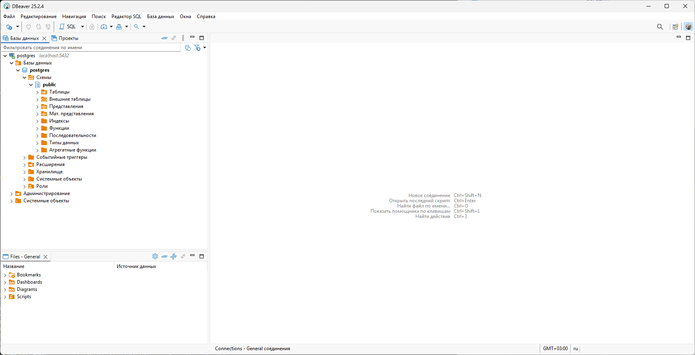

# Занятие 10. СУБД и Docker

## Теоретическая часть

### СУБД

СУБД - это система управления базами данных, которая позволяет хранить и управлять данными. 

СУБД можно разделить на две группы:

- Реляционные СУБД - это СУБД, которые используют реляционную модель данных.
- Нереляционные СУБД - это СУБД, которые используют нереляционную модель данных.

Реляционные СУБД используют реляционную модель данных, которая основана на теории отношений.

Нереляционные СУБД используют нереляционную модель данных, которая основана на других принципах.

В данном занятии мы будем рассматривать реляционные СУБД.

Если рассматривать большинство реляционных СУБД, то в них можно столкнуться с такими понятиями как:

- Таблицы - это основное хранилище данных в реляционных СУБД. Фактически, это набор строк, состоящих из столбцов.
- Столбцы - это поля в таблице.
- Строки - это записи в таблице.
- Ключи - это некие идентификаторы, которые позволяют связать записи в таблицах друг с другом. Их разделяют на первичные и вторичные:
    - Первичный ключ - это уникальный идентификатор записи в таблице.
    - Вторичный ключ - это идентификатор записи в другой таблице, который позволяет связать записи в таблицах друг с другом.
- Индексы - это структуры данных, которые позволяют ускорить поиск данных в таблице.

Визуально данные понятия можно изобразить следующим образом:


Для доступа к данным в реляционных СУБД чаще всего используется язык запросов SQL. Мы не будем рассматривать его в данном занятии, но если будет интересно, то можно познакомиться с ним, например, [здесь](https://www.w3schools.com/sql/).

Существует множество реляционных СУБД, но наиболее часто можно столкнуться с такими:

- PostgreSQL
- MySQL
- SQLite
- Microsoft SQL Server
- Oracle

В данном занятии мы будем рассматривать PostgreSQL.

### Docker

Docker - это платформа для контейнеризации приложений. Она позволяет создавать изолированные среды для приложений, что позволяет упростить процесс развертывания и масштабирования приложений.

Если говорить более понятным языком, то Docker решает проблему "it works on my machine" (ITWOM). То есть если что-то упаковано в Docker-образ, то с высокой долей вероятности оно будет работать на любой другой машине, где есть Docker.

Понятия, с которыми вы столкнетесь при работе с Docker:

- Docker-образ - описание среды, в которой будет работать приложение. По сути, это образ файловой системы.
- Docker-контейнер - экземпляр Docker-образа, который запущен и работает.
- Dockerfile - файл, который описывает, как создать Docker-образ.
- Registry - репозиторий, в котором хранятся Docker-образы.
- Volumes - место для постоянного хранения данных.

Не стоит путать Docker с полноценной виртуальной машиной. Docker-контейнеры - это, по сути, процессы внутри вашей же операционной системы, но изолированные от других процессов при помощи особенностей ОС Linux.

Обычно, когда заходит речь о Docker, то заходит речь и о другом инструменте - Docker Compose. Docker Compose - это инструмент для запуска и управления несколькими Docker-контейнерами одновременно. Подходит для случаев, когда вы, например, хотите запустить микросервисное приложение, которое состоит из нескольких контейнеров, взаимодействующих друг с другом.

## Практическая часть

### Наш первый Docker-контейнер

Перед тем, как переходить к коду на C#, давайте используем Docker и развернем экземпляр PostgreSQL.

Данный этап предполагает, что вы уже имеете установленный Docker на вашей машине. Если нет, то с инструкциями по установке можно ознакомиться [здесь](https://docs.docker.com/get-docker/).

Для развертывания мы будем использовать Docker Compose.

Cоздадим файл `docker-compose.yml`:

```yaml
services:
  postgres:
    image: postgres:16
    ports:
      - "5432:5432"
    environment:
      POSTGRES_USER: postgres
      POSTGRES_PASSWORD: postgres
      POSTGRES_DB: postgres
    volumes:
      - postgres_data:/var/lib/postgresql/data

volumes:
  postgres_data:
```

В данном файле мы описали, что хотим развернуть Docker-контейнер под названием `postgres`, который будет использовать образ `postgres` с тегом `16`.

Также мы указали, что хотим, чтобы порт 5432 контейнера (это стандартный порт PostgreSQL для приема соединений) был доступен остальным приложениям на компьютере с тем же номером. По умолчанию, он не будет доступен остальным приложениям для изоляции процессов.

Далее мы указали, что хотим использовать для контейнера следующие значения переменных окружения:

- Для `POSTGRES_USER` мы указали `postgres` - это имя пользователя для доступа к базе данных.
- Для `POSTGRES_PASSWORD` мы указали `postgres` - это пароль для доступа к базе данных.
- Для `POSTGRES_DB` мы указали `postgres` - это имя базы данных.

И пользователя, и базу данных скрипт внутри контейнера создаст сам.

В самом конце мы указали, что хотим использовать постоянное хранилище для данных СУБД. Для этого мы создали том (volume) под названием `postgres_data` и привязали его к каталогу `/var/lib/postgresql/data` внутри контейнера.

Теперь мы можем запустить наш контейнер при помощи команды:

```bash
docker compose up
```

Если всё сделано правильно, то в консоли вы увидите несколько строк, среди которых должна быть строка следующего вида:

```
postgres-1  | 2025-11-16 14:30:07.889 UTC [1] LOG:  listening on IPv4 address "0.0.0.0", port 5432
postgres-1  | 2025-11-16 14:30:07.889 UTC [1] LOG:  listening on IPv6 address "::", port 5432
postgres-1  | 2025-11-16 14:30:07.895 UTC [1] LOG:  listening on Unix socket "/var/run/postgresql/.s.PGSQL.5432"
postgres-1  | 2025-11-16 14:30:07.907 UTC [1] LOG:  database system is ready to accept connections
```

После запуска мы можем посмотреть на нашу базу данных при помощи, например, [DBeaver](https://dbeaver.io/).

Для этого нужно добавить новое соединение с базой данных. В качестве хоста мы укажем `localhost`, в качестве порта мы укажем `5432`, в качестве пользователя мы укажем `postgres`, в качестве пароля мы укажем `postgres`, в качестве базы данных мы укажем `postgres`.



### Подготовка проекта

После того, как мы развернули нашу базу данных, мы можем приступать к части на C#, которая будет работать с базой данных.

Создадим проект следующими командами:

```bash
dotnet new solution -n 10-db-and-docker
dotnet sln migrate
rm 10-db-and-docker.sln
```

Далее перенесем файлы из [занятия 9](../09-clean-architecture/README.md) в наш проект. Нам понядобятся:

- Проект `AutoMarketApp.Entities`;
- Проект `AutoMarketApp.UseCases`;
- Проект `AutoMarketApp.Infrastructure`, но мы оставим в нем только DTO-классы.
- Проект `AutoMarketApp.Presentation`;
- Проект `AutoMarketApp.Host`.

Добавим проекты в решение:

```bash
dotnet sln add ./AutoMarketApp.Entities/AutoMarketApp.Entities.csproj
dotnet sln add ./AutoMarketApp.UseCases/AutoMarketApp.UseCases.csproj
dotnet sln add ./AutoMarketApp.Infrastructure/AutoMarketApp.Infrastructure.csproj
dotnet sln add ./AutoMarketApp.Presentation/AutoMarketApp.Presentation.csproj
dotnet sln add ./AutoMarketApp.Host/AutoMarketApp.Host.csproj
```

На данном этапе у нас есть полностью работающее приложение, у которого не хватает реализации инфраструктурного слоя.

### Доступ к базе данных

Обычно в .NET-приложениях для доступа к базе данных используются различные ORM. ORM расшифровывается как Object-Relational Mapping и позволяет работать с объектами базы данных (таблицы и строки в них) так, будто это обычные объекты в памяти.

Наиболее используемыми ORM в .NET являются:

- Dapper;
- Entity Framework Core (EF Core);
- Linq2DB.

В данном занятии мы будем использовать EF Core.

#### Добавление EF Core в проект

Для использования EF Core в проекте нам нужно добавить в проект несколько зависимостей. Для этого выполним команды:

```bash
dotnet add ./AutoMarketApp.Infrastructure/AutoMarketApp.Infrastructure.csproj package Microsoft.EntityFrameworkCore --version 9
dotnet add ./AutoMarketApp.Infrastructure/AutoMarketApp.Infrastructure.csproj package Microsoft.EntityFrameworkCore.Design --version 9
dotnet add ./AutoMarketApp.Infrastructure/AutoMarketApp.Infrastructure.csproj package Npgsql.EntityFrameworkCore.PostgreSQL --version 9
dotnet add ./AutoMarketApp.Infrastructure/AutoMarketApp.Infrastructure.csproj package Microsoft.Extensions.Configuration --version 9
```

Первая зависимость - это сам EF Core. Вторая зависимость - это инструменты для управления миграциями (о них мы поговорим позже). Третья зависимость - это библиотека для работы с PostgreSQL. Четвертая зависимость - это библиотека для работы с конфигурацией.

#### Создание контекста базы данных

В EF Core для работы с базой данными используется контекст базы данных. Контекст базы данных - это класс, который представляет собой сеанс работы с базой данных, реализующий паттерн Unit of Work.

Для создания контекста базы данных нам нужно создать класс, который будет наследоваться от `DbContext`. Для этого создадим файл `AutoMarketAppDbContext.cs` в каталоге `Data` проекта `AutoMarketApp.Infrastructure`:

```csharp
using AutoMarketApp.Infrastructure.Data.Dtos;
using Microsoft.EntityFrameworkCore;

namespace AutoMarketApp.Infrastructure.Data;

internal sealed class AutoMarketAppDbContext(DbContextOptions<AutoMarketAppDbContext> options) : DbContext(options)
{
    public DbSet<CarDto> Cars { get; set; }
    public DbSet<CustomerDto> Customers { get; set; }

    protected override void OnModelCreating(ModelBuilder modelBuilder)
    {
        modelBuilder.Entity<CarDto>(builder =>
        {
            builder.HasKey(c => c.Vin);
            builder.ToTable("Cars");
            
            builder.OwnsOne(c => c.Reservation, reservation =>
            {
                reservation.Property(r => r.ReservationDate).HasColumnName("ReservationDate");
                reservation.Property(r => r.CustomerId).HasColumnName("ReservationCustomerId");
                reservation.Property(r => r.ExpirationDate).HasColumnName("ReservationExpirationDate");

                reservation
                    .HasOne<CustomerDto>()
                    .WithMany()
                    .HasForeignKey(r => r.CustomerId);
            });
            
            builder.OwnsOne(c => c.Sale, sale =>
            {
                sale.Property(s => s.SaleDate).HasColumnName("SaleDate");
                sale.Property(s => s.CustomerId).HasColumnName("SaleCustomerId");

                sale
                    .HasOne<CustomerDto>()
                    .WithMany()
                    .HasForeignKey(r => r.CustomerId);
            });
        });

        modelBuilder.Entity<CustomerDto>(builder =>
        {
            builder.HasKey(c => c.Id);
            builder.ToTable("Customers");
            
            builder.Property(c => c.Name).IsRequired();
            builder.Property(c => c.Email).IsRequired();
            builder.Property(c => c.Phone).IsRequired();
        });
    }
}
```

В данном классе мы описали, что у нас есть две таблицы: `Cars` и `Customers`.

В таблице `Cars` мы храним представление класса `CarDto`. Ключом данной таблицы является свойство `Vin`. Также мы описали, что у нас есть два вложенных объекта: `Reservation` и `Sale`.

В таблице `Customers` мы хранение представление класса `CustomerDto`. Ключом данной таблицы является свойство `Id`. Также мы описали, что у нас есть свойства: `Name`, `Email` и `Phone`. Данные свойства являются обязательными, то есть они не могут принимать значение `null`.

Теперь добавим код регистрации контекста базы данных. Для этого создадим класс `ServiceCollectionExtensions` в корне проекта `AutoMarketApp.Infrastructure`:

```csharp
using AutoMarketApp.Infrastructure.Data;
using Microsoft.EntityFrameworkCore;
using Microsoft.Extensions.Configuration;
using Microsoft.Extensions.DependencyInjection;

namespace AutoMarketApp.Infrastructure;

public static class ServiceCollectionExtensions
{
    public static IServiceCollection AddInfrastructure(this IServiceCollection services)
    {
        return services.AddDbContext<AutoMarketAppDbContext>((serviceProvider, options) =>
        {
            var configuration = serviceProvider.GetRequiredService<IConfiguration>();
            options.UseNpgsql(configuration.GetConnectionString("DefaultConnection"));
        });
    }
}
```

В данном классе мы регистрируем контекст базы данных в DI-контейнере. Для этого мы используем метод `AddDbContext`, который в качестве аргумента принимает лямбда-выражение для настройки контекста. Внутри лямбда-выражения мы получаем конфигурацию приложения и вытаскиваем из нее строку подключения к базе данных, которую далее используем для включения поддержки PostgreSQL в контексте базы данных.

#### Репозитории

Теперь, когда у нас есть контекст базы данных, можно приступать к реализации репозиториев.

Начнем с покупателей. Для начала добавим класс-маппер между DTO и доменными сущностями - для этого создадим класс `DataMapper` в каталоге `Data` проекта `Infrastructure`:

```csharp
using AutoMarketApp.Infrastructure.Data.Dtos;

namespace AutoMarketApp.Infrastructure.Data;

using Entities.Models;
using Riok.Mapperly.Abstractions;

[Mapper]
internal static partial class DataMapper
{
    public static partial Customer ToEntity(this CustomerDto dto);
    public static partial CustomerDto ToDto(this Customer entity);
    private static partial MobilePhone ToPhone(this string phone);
    private static partial Email ToEmail(this string email);
}
```

Далее в каталоге `Data/Customers` создадим класс `EfListCustomersRepository`:

```csharp
using AutoMarketApp.Entities.Models;
using AutoMarketApp.Infrastructure.Data;
using AutoMarketApp.UseCases.Customers.ListCustomers;

namespace AutoMarketApp.Infrastructure.Data.Customers;

internal sealed class EfListCustomersRepository(AutoMarketAppDbContext dbContext) : IListCustomersRepository
{
    public IReadOnlyList<Customer> GetAll()
    {
        return [.. dbContext.Customers.Select(DataMapper.ToEntity)];
    }
}
```

В данном классе мы получили в конструкторе экземпляр нашего контекста базы данных и реализовали метод `GetAll`, который возвращает всех покупателей из базы данных.

Повторим то же самое с репозиторием для добавления покупателя. Для этого в каталоге `Data/Customers` создадим класс `EfAddCustomerRepository`:

```csharp
using AutoMarketApp.Entities.Models;
using AutoMarketApp.Infrastructure.Data;
using AutoMarketApp.UseCases.Customers.AddCustomer;

namespace AutoMarketApp.Infrastructure.Data.Customers;

internal sealed class EfAddCustomerRepository(AutoMarketAppDbContext dbContext) : IAddCustomersRepository
{
    public void Add(Customer customer)
    {
        dbContext.Customers.Add(customer.ToDto());
        dbContext.SaveChanges();
    }
}
```

Здесь интересным является метод `SaveChanges`. Так как контекст базы данных реализуется паттерн Unit of Work, то он не отправляет изменения в базу данных до тех пор, пока мы явно не выразим намерения сохранить изменения. Поэтому любое изменение происходит, как минимум, в два этапа:

1. Изменение состояния объектов в контексте;
2. Отправка изменений в базу данных.

Теперь перейдем к автомобилям. Для начала обновим класс `DataMapper`:

```csharp
using AutoMarketApp.Infrastructure.Data.Dtos;

namespace AutoMarketApp.Infrastructure.Data;

using Entities.Models;
using Riok.Mapperly.Abstractions;

[Mapper]
internal static partial class DataMapper
{
    /* Customers */
    public static partial Customer ToEntity(this CustomerDto dto);
    public static partial CustomerDto ToDto(this Customer entity);

    /* Cars */
    public static partial CarDto ToDto(this Car entity);
    [MapperIgnoreSource(nameof(ReservationDto.CustomerId))]
    public static partial Reservation ToEntity(this ReservationDto dto, CustomerDto customer);
    [MapperIgnoreSource(nameof(Reservation.IsActive))]
    public static partial ReservationDto ToDto(this Reservation entity);
    [MapperIgnoreSource(nameof(SaleDto.CustomerId))]
    public static partial Sale ToEntity(this SaleDto dto, CustomerDto customer);
    public static partial SaleDto ToDto(this Sale entity);

    /* Utils */
    private static partial MobilePhone ToPhone(this string phone);
    private static partial Email ToEmail(this string email);
}
```

Как видим, мы не стали добавлять маппинг из DTO обратно в доменную сущность, так как он достаточно сложен для описания в маппере. Мы убедимся в этом позже.

Теперь в каталоге `Data/Cars` создадим класс `EfListCarsRepository`:

```csharp
using AutoMarketApp.Entities.Models;
using AutoMarketApp.Infrastructure.Data;
using AutoMarketApp.UseCases.Cars.ListCars;

internal sealed class EfListCarsRepository(AutoMarketAppDbContext dbContext) : IListCarsRepository
{
    public IReadOnlyList<Car> GetAll()
    {
        // Extract all cars
        var cars = dbContext.Cars.ToList();
        
        // Extract all customers that we require
        var customerIds = cars
            .SelectMany(x => new[] {x.Reservation?.CustomerId, x.Sale?.CustomerId})
            .Where(x => x is not null)
            .Cast<Guid>()
            .Distinct()
            .ToList();

        var customers = dbContext.Customers
            .Where(x => customerIds.Contains(x.Id))
            .ToDictionary(x => x.Id);

        if (customers.Count != customerIds.Count)
        {
            throw new InvalidOperationException("Unknown customers in reservations or sales");
        }
        
        // Convert cars
        return cars
            .Select(x => new Car(
                x.Vin,
                x.Reservation?.ToEntity(customers[x.Reservation.CustomerId]),
                x.Sale?.ToEntity(customers[x.Sale.CustomerId])))
            .ToList();
    }
}
```

В методе можно видеть, что мы сделали отдельный запрос к базе данных для получения покупателей, для которых мы резервировали или продавали автомобили. Поэтому этого мы используем полученных покупателей для маппинга автомобилей.

Теперь перейдем к репозиторию для добавления автомобиля. Для этого в каталоге `Data/Cars` создадим класс `EfAddCarRepository`:

```csharp
using AutoMarketApp.Entities.Models;
using AutoMarketApp.UseCases.Cars.AddCar;

namespace AutoMarketApp.Infrastructure.Data.Cars;

internal sealed class EfAddCarRepository(AutoMarketAppDbContext dbContext) : IAddCarRepository
{
    public void Add(Car car)
    {
        dbContext.Add(car.ToDto());
        dbContext.SaveChanges();
    }
}
```

Данный репозиторий, по сути, ничем не отличается от аналогичного репозитория для покупателей.

Теперь перейдем к резервированию автомобиля. Для резервирования и для продажи мы реализуем оба интерфейса в одном классе, так как у них одинаковые методы. Для этого в каталоге `Data/Cars` создадим класс `EfCarOperationRepository`:

```csharp
using AutoMarketApp.Entities.Models;
using AutoMarketApp.Infrastructure.Data.Dtos;
using AutoMarketApp.UseCases.Cars.ReserveCar;
using AutoMarketApp.UseCases.Cars.SellCar;
using Microsoft.EntityFrameworkCore;

namespace AutoMarketApp.Infrastructure.Data.Cars;

internal sealed class EfCarOperationRepository(AutoMarketAppDbContext dbContext) : IReserveCarRepository, ISellCarRepository
{
    public Car? GetByVin(string vin)
    {
        var car = dbContext.Cars
            .AsNoTracking()
            .SingleOrDefault(c => c.Vin == vin);

        if (car is null)
        {
            return null;
        }
        
        Reservation? reservation = null;

        if (car.Reservation is not null)
        {
            var customer = GetExistingCustomerById(car.Reservation.CustomerId);
            reservation = car.Reservation.ToEntity(customer);
        }
        
        Sale? sale = null;

        if (car.Sale is not null)
        {
            var customer = GetExistingCustomerById(car.Sale.CustomerId);
            sale = car.Sale.ToEntity(customer);
        }
        
        return new Car(car.Vin, reservation, sale);
    }

    public Customer? GetCustomerById(Guid id)
    {
        return dbContext.Customers.SingleOrDefault(x => x.Id == id)?.ToEntity();
    }

    public void Save(Car car)
    {
        dbContext.Update(car.ToDto());
        dbContext.SaveChanges();
    }

    private CustomerDto GetExistingCustomerById(Guid id)
    {
        return dbContext.Customers
            .AsNoTracking()
            .Single(x => x.Id == id);
    }
}
```

После этого зарегистрируем все наши репозитории в DI-контейнере. Для этого обновим класс `ServiceCollectionExtensions`:

```csharp
using AutoMarketApp.Infrastructure.Data;
using AutoMarketApp.Infrastructure.Data.Cars;
using AutoMarketApp.Infrastructure.Data.Customers;
using AutoMarketApp.UseCases.Cars.AddCar;
using AutoMarketApp.UseCases.Cars.ListCars;
using AutoMarketApp.UseCases.Cars.ReserveCar;
using AutoMarketApp.UseCases.Cars.SellCar;
using AutoMarketApp.UseCases.Customers.AddCustomer;
using AutoMarketApp.UseCases.Customers.ListCustomers;
using Microsoft.EntityFrameworkCore;
using Microsoft.Extensions.Configuration;
using Microsoft.Extensions.DependencyInjection;

namespace AutoMarketApp.Infrastructure;

public static class ServiceCollectionExtensions
{
    public static IServiceCollection AddInfrastructure(this IServiceCollection services)
    {
        services.AddDbContext<AutoMarketAppDbContext>((serviceProvider, options) =>
        {
            var configuration = serviceProvider.GetRequiredService<IConfiguration>();
            options.UseNpgsql(configuration.GetConnectionString("DefaultConnection"));
        });

        services.AddScoped<IListCustomersRepository, EfListCustomersRepository>();
        services.AddScoped<IAddCustomersRepository, EfAddCustomerRepository>();
        services.AddScoped<IListCarsRepository, EfListCarsRepository>();
        services.AddScoped<IAddCarRepository, EfAddCarRepository>();
        services.AddScoped<IReserveCarRepository, EfCarOperationRepository>();
        services.AddScoped<ISellCarRepository, EfCarOperationRepository>();

        return services;
    }
}
```

Из кода видно, что, в отличие от предыдущего занятия, мы регистрируем репозитории как Scoped-сервисы. Это означает, что для каждого запроса будет создаваться новый экземпляр репозитория. Это необходимо, так как по умолчанию контекст базы данных тоже является Scoped-сервисом.

#### Миграции

Чтобы наши таблицы были созданы в базе данных, используется специальный механизм, называемый миграциями. Миграции позволяют изменять структуру базы данных по-шагово, аналогично тому, как мы логируем шаги изменения кода в Git.

В EF Core есть встроенный механизм управления миграциями, включающий также их автоматическую генерацию.

Чтобы включить механизм генерации миграций, нам нужно добавить в каталог `Data` проекта `Infrastructure` специальный класс `DbContextFactory`:

```csharp
using Microsoft.EntityFrameworkCore;
using Microsoft.EntityFrameworkCore.Design;

namespace AutoMarketApp.Infrastructure.Data;

internal sealed class DesignTimeDbContextFactory : IDesignTimeDbContextFactory<AutoMarketAppDbContext>
{
    public AutoMarketAppDbContext CreateDbContext(string[] args)
    {
        var options = new DbContextOptionsBuilder<AutoMarketAppDbContext>()
            .UseNpgsql("Server=127.0.0.1;Port=5432;Database=myDataBase;User Id=myUsername;Password=myPassword;")
            .Options;
        
        return new AutoMarketAppDbContext(options);
    }
}
```

Данный класс говорит EF Core, какой контекст базы данных использовать и как его настроить. В данном случае мы указали, что хотим использовать PostgreSQL и указали параметры подключения - подключаться мы никуда фактически не будем и здесь можно указать любые параметры, которые нам нравятся.

После добавления класс можно сгенерировать миграции при помощи команды:

```bash
dotnet tool install dotnet-ef --version 9 --create-manifest-if-needed
dotnet ef migrations add InitialCreate -p ./AutoMarketApp.Infrastructure/AutoMarketApp.Infrastructure.csproj
```

После выполнения данной команды EF Core, скоре всего, скажет нам, что не может создать миграцию, так как ему не нравится наш класс `CarDto`. Обновим данный класс таким образом, чтобы в конструкторе не было других DTO:

```csharp
namespace AutoMarketApp.Infrastructure.Data.Dtos;

public sealed record CarDto(string Vin)
{
    public SaleDto? Sale { get; init; }
    public ReservationDto? Reservation { get; init; }
}
```

После этого можно сгенерировать миграции снова:

```bash
dotnet ef migrations add InitialCreate -p ./AutoMarketApp.Infrastructure/AutoMarketApp.Infrastructure.csproj
```

Если всё сделано верно, то в каталоге `Migrations` проекта `Infrastructure` будут созданы файлы, относящиеся к нашей миграции.

#### Запуск миграций

Миграции после их создания не смогут запуститься самостоятельно. Для этого нужно либо добавить инструменты в само приложение, либо запустить их при помощи инструментов внутри EF Core. Мы воспользуемся первым вариантом, а именно добавим в наше приложение специальный севрис, который будет запускаться при старте приложения и запускать миграции.

Для этого добавим зависимость в проект `Infrastructure`:

```bash
dotnet add ./AutoMarketApp.Infrastructure/AutoMarketApp.Infrastructure.csproj package Microsoft.Extensions.Hosting --version 9
```

Данная зависимость содержит примитив для создания так называемых фоновых сервисов, которые запускаются при старте приложения.

Для создания такого сервиса в каталог `Data` проекта `Infrastructure` создадим класс `MigrationRunner`:

```csharp
using Microsoft.EntityFrameworkCore;
using Microsoft.Extensions.DependencyInjection;
using Microsoft.Extensions.Hosting;

namespace AutoMarketApp.Infrastructure.Data;

internal sealed class MigrationRunner(IServiceScopeFactory serviceScopeFactory) : IHostedService
{
    public async Task StartAsync(CancellationToken cancellationToken)
    {
        await Task.Yield();
        
        using var scope = serviceScopeFactory.CreateScope();
        await using var dbContext = scope.ServiceProvider.GetRequiredService<AutoMarketAppDbContext>();
        await dbContext.Database.MigrateAsync(cancellationToken);
    }

    public Task StopAsync(CancellationToken cancellationToken) => Task.CompletedTask;
}
```

В данном классе мы реализуем специальный интерфейс `IHostedService`, который имеет два метода:

- `StartAsync` - метод, который вызывается при старте приложения;
- `StopAsync` - метод, который вызывается при остановке приложения.

В методе `StartAsync` мы получаем экземпляр контекста базы данных и вызываем метод `Database.MigrateAsync`, который запускает миграции.

Теперь добавим регистрацию нашего сервиса в DI-контейнер. Для этого обновим класс `ServiceCollectionExtensions`:

```csharp
using AutoMarketApp.Infrastructure.Data;
using AutoMarketApp.Infrastructure.Data.Cars;
using AutoMarketApp.Infrastructure.Data.Customers;
using AutoMarketApp.UseCases.Cars.AddCar;
using AutoMarketApp.UseCases.Cars.ListCars;
using AutoMarketApp.UseCases.Cars.ReserveCar;
using AutoMarketApp.UseCases.Cars.SellCar;
using AutoMarketApp.UseCases.Customers.AddCustomer;
using AutoMarketApp.UseCases.Customers.ListCustomers;
using Microsoft.EntityFrameworkCore;
using Microsoft.Extensions.Configuration;
using Microsoft.Extensions.DependencyInjection;

namespace AutoMarketApp.Infrastructure;

public static class ServiceCollectionExtensions
{
    public static IServiceCollection AddInfrastructure(this IServiceCollection services)
    {
        services.AddDbContext<AutoMarketAppDbContext>((serviceProvider, options) =>
        {
            var configuration = serviceProvider.GetRequiredService<IConfiguration>();
            options.UseNpgsql(configuration.GetConnectionString("DefaultConnection"));
        });

        services.AddScoped<IListCustomersRepository, EfListCustomersRepository>();
        services.AddScoped<IAddCustomersRepository, EfAddCustomerRepository>();
        services.AddScoped<IListCarsRepository, EfListCarsRepository>();
        services.AddScoped<IAddCarRepository, EfAddCarRepository>();
        services.AddScoped<IReserveCarRepository, EfCarOperationRepository>();
        services.AddScoped<ISellCarRepository, EfCarOperationRepository>();

        services.AddHostedService<MigrationRunner>();

        return services;
    }
}
```

Из кода видно, что мы регистрируем наш сервис при помощи метода `AddHostedService`. Это позволяет нам запускать миграции при старте приложения.

### Упаковка приложения в Docker-образ

Теперь мы можем упаковать наше приложение в Docker-образ. Для этого создадим файл `Dockerfile` в корне решения:

```dockerfile
FROM mcr.microsoft.com/dotnet/sdk:9.0 AS build
WORKDIR /src

COPY ["AutoMarketApp.Entities/AutoMarketApp.Entities.csproj", "AutoMarketApp.Entities/"]
COPY ["AutoMarketApp.Infrastructure/AutoMarketApp.Infrastructure.csproj", "AutoMarketApp.Infrastructure/"]
COPY ["AutoMarketApp.UseCases/AutoMarketApp.UseCases.csproj", "AutoMarketApp.UseCases/"]
COPY ["AutoMarketApp.Presentation/AutoMarketApp.Presentation.csproj", "AutoMarketApp.Presentation/"]
COPY ["AutoMarketApp.Host/AutoMarketApp.Host.csproj", "AutoMarketApp.Host/"]

RUN dotnet restore "AutoMarketApp.Host/AutoMarketApp.Host.csproj"

COPY . .

WORKDIR "/src/AutoMarketApp.Host"

RUN dotnet publish -c Release -o /out

FROM mcr.microsoft.com/dotnet/aspnet:9.0 AS publish
WORKDIR /app
COPY --from=build /out .
ENTRYPOINT ["dotnet", "AutoMarketApp.Host.dll"]
```

Данный файл говорит Docker, как построить наш образ. Каждая инструкция в данном файле описывает один шаг построения образа или один слой образа.

В качестве начального шага мы будуем другой образ, в котором уже присутствует .NET SDK версии 9. Далее мы копируем файлы проектов и восстанавливаем зависимости. После этого мы копируем оставшиеся файлы и собираем приложение. В самом конце мы объявляем команду, которая будет выполнена при старте контейнера.

Выполним команду и проверим, что образ был успешно создан:

```bash
docker build -t auto-market-app .
```

Если всё сделано верно, то сборка образа завершится успешно.

### Запуск приложения в Docker-контейнере

Теперь добавим наше приложение в файл `docker-compose.yml`:

```yaml
services:
  postgres:
    image: postgres:16
    ports:
      - "5432:5432"
    environment:
      POSTGRES_USER: postgres
      POSTGRES_PASSWORD: postgres
      POSTGRES_DB: postgres
    volumes:
      - postgres_data:/var/lib/postgresql/data
  auto-market-app:
    build:
      context: .
      dockerfile: Dockerfile
    ports:
      - "5000:8080"
    environment:
      ASPNETCORE_ENVIRONMENT: Development
      CONNECTIONSTRINGS__DEFAULTCONNECTION: Server=postgres:5432;Database=postgres;User Id=postgres;Password=postgres;
    depends_on:
      - postgres

volumes:
  postgres_data:
```

И запустим его:

```bash
docker compose up --build
```

Скорее всего, при первой попытке построения мы увидим ошибку, говорящую о том, что наши сервисы, объявленные в слое `UseCases`, не могут использовать зависимости из слоя `Infrastructure`, так как Singletone-сервисы не могут использовать Scoped-сервисы.

Обновим файл `ServiceCollectionExtensions` в проекте `UseCases`, чтобы зарегистрировать сервисы с нужным типом времени жизни:

```csharp
using AutoMarketApp.UseCases.Cars.AddCar;
using AutoMarketApp.UseCases.Cars.ListCars;
using AutoMarketApp.UseCases.Cars.ReserveCar;
using AutoMarketApp.UseCases.Cars.SellCar;
using AutoMarketApp.UseCases.Customers.AddCustomer;
using AutoMarketApp.UseCases.Customers.ListCustomers;
using Microsoft.Extensions.DependencyInjection;

namespace AutoMarketApp.UseCases;

public static class ServiceCollectionExtensions
{
    public static IServiceCollection AddUseCases(this IServiceCollection services)
    {
        services.AddScoped<IListCustomersRequestHandler, ListCustomersRequestHandler>();
        services.AddScoped<IAddCustomersRequestHandler, AddCustomersRequestHandler>();
        services.AddScoped<IListCarsRequestHandler, ListCarsRequestHandler>();
        services.AddScoped<IAddCarRequestHandler, AddCarRequestHandler>();
        services.AddScoped<IReserveCarRequestHandler, ReserveCarRequestHandler>();
        services.AddScoped<ISellCarRequestHandler, SellCarRequestHandler>();

        return services;
    }
}
```

Теперь выполним команду запуска приложения:

```bash
docker compose up --build
```

Если всё сделано верно, то в окне терминала мы увидим подобный вывод:

```
auto-market-app-1  |       SELECT "MigrationId", "ProductVersion"
auto-market-app-1  |       FROM "__EFMigrationsHistory"
auto-market-app-1  |       ORDER BY "MigrationId";
auto-market-app-1  | info: Microsoft.EntityFrameworkCore.Migrations[20402]
auto-market-app-1  |       Applying migration '20251116181736_InitialCreate'.
auto-market-app-1  | info: Microsoft.Hosting.Lifetime[14]
auto-market-app-1  |       Now listening on: http://[::]:8080
auto-market-app-1  | info: Microsoft.Hosting.Lifetime[0]
auto-market-app-1  |       Application started. Press Ctrl+C to shut down.
auto-market-app-1  | info: Microsoft.Hosting.Lifetime[0]
auto-market-app-1  |       Hosting environment: Development
auto-market-app-1  | info: Microsoft.Hosting.Lifetime[0]
auto-market-app-1  |       Content root path: /app
```

Теперь можно перейти по адресу `http://localhost:5000/swagger/index.html` и увидеть, что наше приложение работает и мы можем взаимодействовать с ним через Swagger.

## Фиксы багов

Пока проверял материал данного занятия, наткнулся на одну ошибку. Из-за нее нельзя купить зарезервированный автомобиль, даже если бронь принадлежит покупателю. Чтобы поправить, нужно обновить файл `SellCarRequestHandler` в проекте `UseCases`:

```csharp
using AutoMarketApp.Entities.Models;

namespace AutoMarketApp.UseCases.Cars.SellCar;

internal sealed class SellCarRequestHandler : ISellCarRequestHandler
{
    private readonly ISellCarRepository _repository;
    private readonly TimeProvider _timeProvider;

    public SellCarRequestHandler(ISellCarRepository repository, TimeProvider timeProvider)
    {
        _repository = repository;
        _timeProvider = timeProvider;
    }

    public SellCarResponse Handle(SellCarRequest request)
    {
        var customer = _repository.GetCustomerById(request.CustomerId);
        if (customer is null)
            throw new InvalidOperationException($"Customer with ID {request.CustomerId} not found");

        var car = _repository.GetByVin(request.Vin);
        if (car is null)
            throw new InvalidOperationException($"Car with VIN {request.Vin} not found");

        if (car.Sale is not null)
            throw new InvalidOperationException($"Car with VIN {request.Vin} is already sold");

        if (car.Reservation is not null && car.Reservation.IsActive && car.Reservation.Customer.Id != customer.Id)
            throw new InvalidOperationException($"Car with VIN {request.Vin} is already reserved");

        var sale = new Sale(_timeProvider.GetUtcNow(), customer);
        var soldCar = new Car(car.Vin, reservation: null, sale);
        
        _repository.Save(soldCar);

        return soldCar.ToDto();
    }
}
```